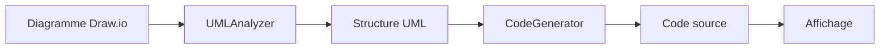
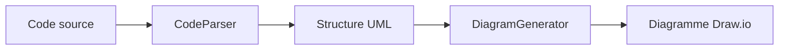

# 🚀 Code Generator Plugin pour Draw.io

Un plugin bidirectionnel pour Draw.io Desktop qui permet de générer du code source à partir de diagrammes UML de classes et vice-versa.


## 📋 Table des matières

- [Fonctionnalités](#-fonctionnalités)
- [Installation](#-installation)
- [Utilisation](#-utilisation)
- [Langages supportés](#-langages-supportés)
- [Exemples](#-exemples)
- [TODO](#-todo)

## ✨ Fonctionnalités

### Génération de code (UML → Code)

- ✅ Analyse automatique des diagrammes UML de classes
- ✅ Génération de code en **Java**, **Python** et **TypeScript**
- ✅ Support des attributs avec types
- ✅ Génération automatique de getters/setters
- ✅ Détection des relations entre classes (héritage, agrégation, etc.)
- ✅ Mise à jour automatique en temps réel

### Génération de diagrammes (Code → UML)

- ✅ Parsing de code source Java, Python et TypeScript
- ✅ Création automatique de diagrammes UML
- ✅ Positionnement intelligent des classes
- ✅ Génération des relations entre classes

### Interface utilisateur

- ✅ Panneau latéral élégant avec animation slide
- ✅ Sélection de langage dynamique
- ✅ Copie dans le presse-papier en un clic
- ✅ Export vers fichier (.java, .py, .ts)
- ✅ Éditeur de code intégré

## 📦 Installation

### Méthode 1 : Installation automatique (Draw.io Desktop)

1. Téléchargez le fichier `codegen-toolbar.js`
2. Dans Draw.io, allez dans **Extras → Plugins...**
3. Cliquez sur **Add** et sélectionnez le fichier
4. Redémarrez Draw.io

### Méthode 2 : Installation manuelle

Copiez le fichier dans le dossier des plugins :

```bash
# macOS
cp codegen-toolbar.js ~/Library/Application\ Support/draw.io/plugins/

# Windows
copy codegen-toolbar.js %APPDATA%\draw.io\plugins\

# Linux
cp codegen-toolbar.js ~/.config/draw.io/plugins/
```

## 🎯 Utilisation

### Générer du code depuis un diagramme UML

1. **Créez votre diagramme UML** dans Draw.io
   - Utilisez le style **swimlane** pour les classes
   - Format des attributs : `nom: Type`
   - Format des méthodes : `nomMethode()`

2. **Ouvrez le panneau de génération**
   - Cliquez sur l'icône ⚡ dans la barre d'outils

3. **Générez le code**
   - Sélectionnez votre langage (Java, Python, TypeScript)
   - Cliquez sur **Refresh** pour générer le code
   - Le code apparaît automatiquement dans le panneau

4. **Exportez le code**
   - Cliquez sur **Copy to Clipboard** pour copier
   - Ou **Save as File** pour télécharger

### Générer un diagramme depuis du code

1. **Ouvrez le panneau** (icône ⚡)

2. **Collez votre code** dans la zone de texte

3. **Sélectionnez le langage** correspondant

4. **Cliquez sur "Generate Diagram"**

5. Le diagramme UML est créé automatiquement !

## 🌐 Langages supportés

### Java

```java
public class Person {
    private String name;
    private int age;
    
    public String getName() {
        return this.name;
    }
    
    public void setName(String name) {
        this.name = name;
    }
}
```

### Python

```python
class Person:
    def __init__(self):
        self._name = None  # str
        self._age = None  # int
    
    @property
    def name(self):
        return self._name
    
    @name.setter
    def name(self, value):
        self._name = value
```

### TypeScript

```typescript
export class Person {
    private name: string;
    private age: number;
    
    public getName(): string {
        return this.name;
    }
    
    public setName(value: string): void {
        this.name = value;
    }
}
```

## 📊 Exemples

### Exemple 1 : Classe simple

**Diagramme UML :**

```
┌─────────────────┐
│    Person       │
├─────────────────┤
│ name: String    │
│ age: int        │
├─────────────────┤
│ walk()          │
└─────────────────┘
```

**Code généré (Java) :**

```java
public class Person {
    private String name;
    private int age;
    
    public Person() {
        // Default constructor
    }
    
    public String getName() {
        return this.name;
    }
    
    public void setName(String name) {
        this.name = name;
    }
    
    public int getAge() {
        return this.age;
    }
    
    public void setAge(int age) {
        this.age = age;
    }
}
```

### Exemple 2 : Relations entre classes

Le plugin détecte automatiquement les types de relations :

- **Héritage** : Flèche avec triangle vide
- **Agrégation** : Flèche avec losange vide
- **Dépendance** : Flèche en pointillés
- **Association** : Flèche simple

## 🏗️ Architecture

### Composants principaux

```
codegen-toolbar.js
├── UMLAnalyzer          # Analyse les diagrammes UML
├── CodeGenerator        # Orchestrateur de génération
│   ├── JavaGenerator    # Génère du code Java
│   ├── PythonGenerator  # Génère du code Python
│   └── TypeScriptGenerator # Génère du code TypeScript
├── CodeParser           # Parse le code source
│   ├── JavaParser       # Parse Java
│   ├── PythonParser     # Parse Python
│   └── TypeScriptParser # Parse TypeScript
├── DiagramGenerator     # Crée les diagrammes UML
└── UI Components        # Interface utilisateur
    ├── createCodePanel()
    ├── createToolbarButton()
    └── Event handlers
```

### Flux de données

#### UML → Code



#### Code → UML



## 🛠️ Développement

### Prérequis

- Draw.io Desktop
- Connaissances en JavaScript ES5
- API Draw.io (mxGraph)

### Structure du code

```javascript
// 1. Analyseur UML
UMLAnalyzer.analyzeCurrentDiagram() 
// → { classes: [], relationships: [] }

// 2. Générateur de code
CodeGenerator.generate(umlData, 'java')
// → string (code source)

// 3. Parser de code
CodeParser.parse(code, 'java')
// → { classes: [], relationships: [] }

// 4. Générateur de diagramme
DiagramGenerator.generate(umlData)
// → Modifie le graphe Draw.io
```

### Ajouter un nouveau langage

1. **Créer un générateur** :

```javascript
function RustGenerator() {
    this.generate = function(umlData) {
        var code = '';
        umlData.classes.forEach(function(cls) {
            code += 'pub struct ' + cls.name + ' {\n';
            // ... logique de génération
        });
        return code;
    };
}
```

2. **Créer un parser** :

```javascript
function RustParser() {
    this.parse = function(code) {
        var classes = [];
        var structRegex = /pub struct (\w+)/g;
        // ... logique de parsing
        return { classes: classes, relationships: [] };
    };
}
```

3. **Enregistrer le langage** :

```javascript
CodeGenerator.generators.rust = new RustGenerator();
CodeParser.parsers.rust = new RustParser();
```

4. **Ajouter dans l'UI** :

```javascript
['java', 'python', 'typescript', 'rust'].forEach(function(lang) {
    // ...
});
```

### Debugging

Activer les logs dans la console :

```javascript
console.log('Code Generator: Starting code generation...');
```

Les messages de débogage sont préfixés par `Code Generator:`.

## 🎨 Personnalisation

### Modifier les styles de classes

```javascript
var classCell = graph.insertVertex(
    parent, null, cls.name, x, y, 200, 100,
    'swimlane;fillColor=#e1f5ff;strokeColor=#0288d1;fontColor=#000000;'
);
```

### Changer la disposition des classes

```javascript
var x = 50;  // Position X initiale
var y = 50;  // Position Y initiale
var spacing = 250;  // Espacement horizontal
```

### Personnaliser les templates de code

Modifiez les générateurs dans les classes `JavaGenerator`, `PythonGenerator`, etc.

## 📝 Conventions de code UML

### Format des attributs

```
nom: Type
- nom: Type    (privé)
+ nom: Type    (public)
# nom: Type    (protégé)
```

### Format des méthodes

```
nomMethode()
nomMethode(param: Type)
+ nomMethode(): ReturnType
```

### Styles de classes reconnus

- `swimlane` (recommandé)
- `umlClass`
- Tout style contenant "class" dans le nom

## 🐛 Résolution de problèmes

### Le code n'est pas généré

**Solution** :

- Vérifiez que vous utilisez le style **swimlane** pour vos classes
- Assurez-vous que les attributs suivent le format `nom: Type`
- Cliquez sur **Refresh** pour forcer la régénération

### Le diagramme n'est pas créé depuis le code

**Solution** :

- Vérifiez la syntaxe de votre code
- Assurez-vous que le langage sélectionné correspond au code
- Consultez les logs dans la console du navigateur (F12)

### Le panneau ne s'affiche pas

**Solution** :

- Vérifiez que le plugin est bien chargé dans **Extras → Plugins**
- Rechargez Draw.io
- Vérifiez qu'il n'y a pas d'erreurs JavaScript dans la console

## 📄 License

Ce projet est sous licence Apache 2.0 - voir le fichier LICENSE pour plus de détails.

## 👥 Auteurs

- **Draw.io Team** - Équipe principale Draw.io qui a fait la base
- **Gauthier Clément** - Développeur principal du plugin Code Generator

---

## 📝 TODO

- [ ] Mettre a jour le README avec le code actuel

- [ ] Voir si j'ai tout les fonctionnalités d'ici pour le java : <https://www.datacamp.com/fr/doc/java/enums>

- [ ] Splitter le code en plusieurs fichiers
- [ ] Ajouter d'autre langages de programmation (C#, C++, Ruby)
- [ ] Améliorer l'interface utilisateur (UI/UX, etc...)
